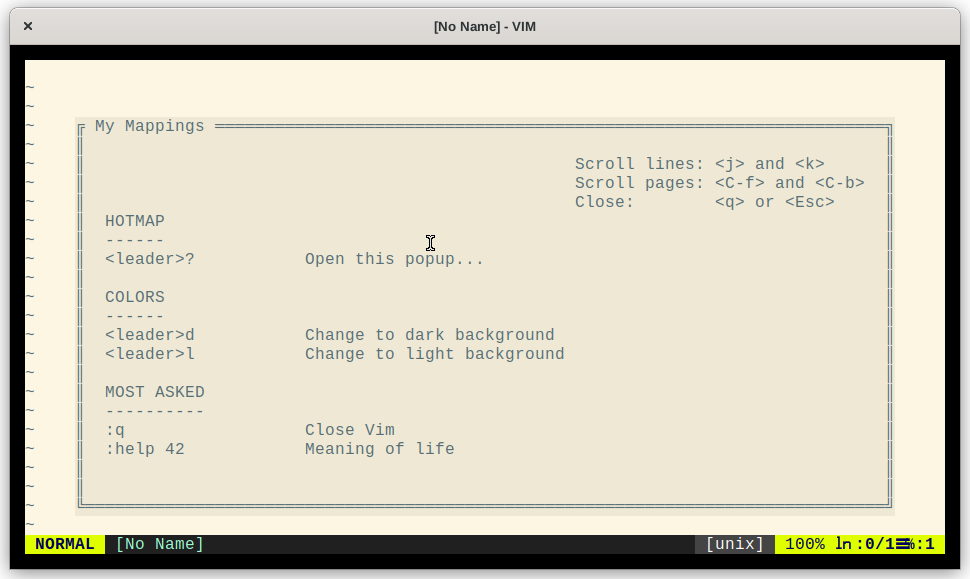

# Vim HotPop - mapping and cheatsheet

When using this plugin to add custom mappings it add's them to a cheatsheet.

* Show cheatsheet in floating popup-window
* No redundant documentation



# Usage

Paste block below.. source your config and type `<leader>?` to get the help
screen shown above.

```
call hotpop#init() "run this before other calls

"              MODE    <SPECIALS> KEYSEQ       COMMAND                     SHEET-PARAGRAPH  SHEET HELP_TEXT
call HotpopMap('nmap', '',        '<leader>?', ':call HotpopShow()<CR>',   'Hotmap',        'Open this popup...')
call HotpopMap('map',  '',        '<leader>d', ':set background=dark<cr>', 'Colors',        'Change to dark background')
call HotpopMap('map',  '',        '<leader>l', ':set background=light<cr>','Colors',        'Change to light background')
call HotpopMap('map',  '',        ':q',        '',                         'Most asked',    'Close Vim')
call HotpopMap('map',  '',        ':help 42',  '',                         'Most asked',    'Meaning of life')
```

**NOTE** Keeping `COMMAND` empty skips the remapping. This is useful for
mappings you just have in your cheatsheet.

# Installation

Use your favorite package manager.

Using vim-plug:

```
Plug 'mipmip/vim-hotpop'
```

